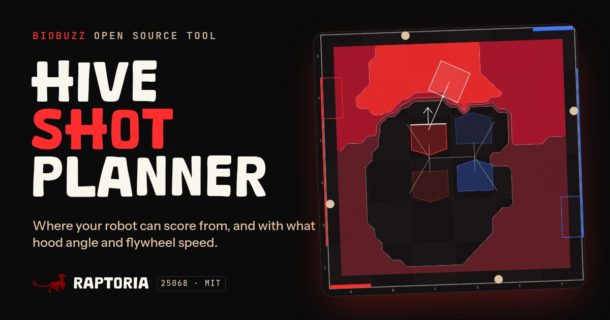

# HIVE Shot Planner

Where your robot can score from in **BIOBUZZ** (FIRST Tech Challenge, 2026–27), and with what hood angle and flywheel speed.

**Open it: https://raptoria25068.github.io/hive-shot-planner/**



Made by FTC team [Raptoria 25068](https://raptoriaftc.com/).

## What it does

- **Maps the whole field.** Every robot position gets a level for scoring into your raised CELL (Guaranteed, Likely or Possible) along with the hood angle and flywheel speed that do it.
- **Solves what you leave blank.** Type a value to fix a setting, a range like `30-75` to let the robot adjust within it, or leave it empty and the planner finds what works best.
- **Twelve map layers:** level, hit chance, hood, flywheel, flight time, entry speed, rim margin, burst results, the biggest error source, tip-proof spots, points per second, and an A/B compare.
- **Side view and 3D view** of the shot from any spot. Tip the HIVE to plan for the other CELL.
- **Calibrates to your shooter.** Shoot a few balls, measure where they land or how high they hit a wall, and fit the model's efficiency, drag, backspin lift and hood offset.
- **Exports lookup tables** as CSV, JSON, or a Java class that interpolates between spots, ready for an OpMode.
- **Presets and share links** keep a team on the same settings.

## How the model works

- The ball flies in 3D under gravity, air drag and backspin lift, stepped every 8 ms.
- The flywheel slows as each ball takes energy, and recovers between the balls of a burst.
- Field geometry follows the BIOBUZZ Competition Manual, Section 9 (TU02): the HIVE pivots and 30° tilt, the 20 × 14 in pentagonal CELL opening, and the frame.
- A shot scores when the ball clears the frame and the other CELLS, enters the opening, and stays in the CELL. Bounces inside the CELL are simulated.
- Levels come from your accuracy settings (hood, heading, flywheel speed, exit height, position, timing and air). Guaranteed means the 3σ spread of shots still scores; Likely means the hit chance is above your threshold.

It is a planning model, not a promise: calibrate it with your own test shots.

## Run it locally

It is a static site with no build step. Serve the folder over HTTP:

```
python3 -m http.server 8000
```

Then open http://localhost:8000/. Opening `index.html` straight from disk does not work, because browsers block the engine's web worker on `file://` pages.

## Tests

With Node.js 22 or newer:

```
node --test test/*.test.cjs test/*.test.mjs
```

## Layout

| Path | Contents |
|------|----------|
| `index.html`, `base.css`, `planner.css` | The page |
| `hive-engine.js` | Physics, aiming and solving. Runs in a web worker, and loads in Node for the tests |
| `js/` | Settings, map, side view, 3D view, readout, calibration and export |
| `vendor/three.module.min.js` | three.js r170 for the 3D view, loaded only when it opens |
| `fonts/` | The Dinofans display font and its license note |
| `test/` | Engine and settings tests |

## License

MIT: see [LICENSE](LICENSE). three.js is MIT-licensed by the three.js authors ([vendor/three.LICENSE](vendor/three.LICENSE)).

### Font

The display font is **Dinofans** by [Khurasan](https://khurasanstudio.com/), which the author releases free for personal and commercial use. It is included unmodified in `fonts/`, with the author's terms in [fonts/Dinofans-LICENSE.txt](fonts/Dinofans-LICENSE.txt). The font is not covered by this project's MIT license. Body and code text use Instrument Sans and JetBrains Mono from Google Fonts (SIL Open Font License).

BIOBUZZ and FIRST Tech Challenge are trademarks of FIRST. This is a team-made tool, not affiliated with or endorsed by FIRST.
